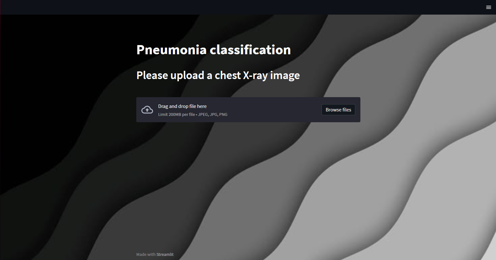

# Detecção de pneumonia em imagens de raio-X

### Este é um projeto de visão computacional que utiliza deep learning para detectar pneumonia em imagens de raio-x. A interface foi construída com Streamlit para facilitar as predições.

## Tecnologias Utilizadas
- YOLO
- OpenCV
- Paillow
- Streamlit
- Python

## Resultados do modelo
- Recall: 100%
- Precision: 89%
- Accuracy: 94%
- Matriz de confusão:

## Dataset utilizado
[dataset](https://www.kaggle.com/datasets/paultimothymooney/chest-xray-pneumonia)
